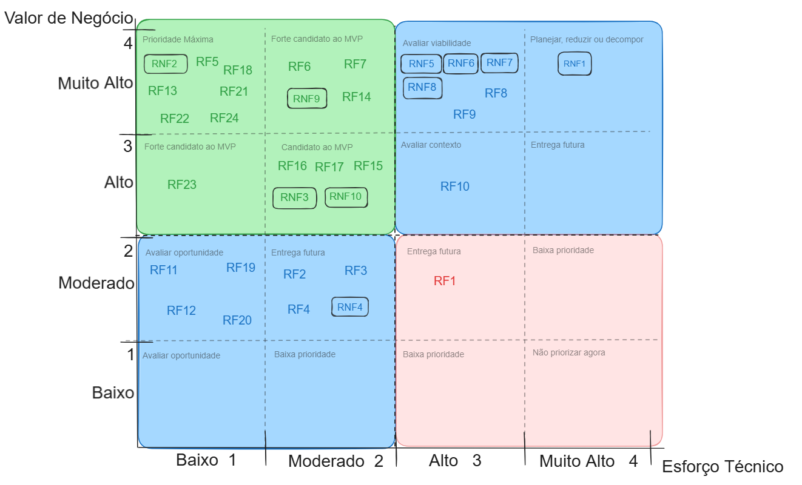

# Avaliação do Valor de Negócio
 
A avaliação de negócio dos requisitos foi realizada por meio de um formulário de priorização, respondido pelos principais stakeholders, a diretora e a coordenadora, representando o cliente. Foram considerados os critérios **de importância para a resolução do problema central e urgência (prioridade)**, resultando na tabela de valor de negócio dos requisitos.

[formulario do google](https://forms.gle/4QGzyiW5N3brAKtC8)

Devido à indisponibilidade dos stakeholders para uma avaliação mais detalhada, as classificações e interpretações apresentam certo nível de generalização. O grupo se compromete a validar posteriormente a tabela com os stakeholders, aprimorando principalmente a especificidade da coluna de **Interpretação**.

## Tabela de Priorização MoSCoW
 
| ID | Pts | Categoria MoSCoW | Interpretação |
|---|---|---|---|
| RF1 | 2 | Could | É uma vontade do cliente mas não é fundamental para resolução do problema, podendo ser adiado. |
| RF2 | 2 | Could | É uma vontade do cliente mas não é fundamental para resolução do problema, podendo ser adiado. |
| RF3 | 2 | Could | É uma vontade do cliente mas não é fundamental para resolução do problema, podendo ser adiado. |
| RF4 | 2 | Could | É uma vontade do cliente mas não é fundamental para resolução do problema, podendo ser adiado. |
| RF5 | 4 | Must | É fundamental no sistema, sem essa funcionalidade presente, não será possível resolver o problema. |
| RF6 | 4 | Must | É fundamental no sistema, sem essa funcionalidade presente, não será possível resolver o problema. |
| RF7 | 4 | Must | É fundamental no sistema, sem essa funcionalidade presente, não será possível resolver o problema. |
| RF8 | 4 | Must | É fundamental no sistema, sem essa funcionalidade presente, não será possível resolver o problema. |
| RF9 | 4 | Must | É fundamental no sistema, sem essa funcionalidade presente, não será possível resolver o problema. |
| RF10 | 3 | Should | Itens importantes de alto valor, mas que não são vitais para a primeira versão. |
| RF11 | 2 | Could | É uma vontade do cliente mas não é fundamental para resolução do problema, podendo ser adiado. |
| RF12 | 2 | Could | É uma vontade do cliente mas não é fundamental para resolução do problema, podendo ser adiado. |
| RF13 | 4 | Must | É fundamental no sistema, sem essa funcionalidade presente, não será possível resolver o problema. |
| RF14 | 4 | Must | É fundamental no sistema, sem essa funcionalidade presente, não será possível resolver o problema. |
| RF15 | 3 | Should | Itens importantes de alto valor, mas que não são vitais para a primeira versão. |
| RF16 | 3 | Should | Itens importantes de alto valor, mas que não são vitais para a primeira versão. |
| RF17 | 3 | Should | Itens importantes de alto valor, mas que não são vitais para a primeira versão. |
| RF18 | 4 | Must | É fundamental no sistema, sem essa funcionalidade presente, não será possível resolver o problema. |
| RF19 | 2 | Could | É uma vontade do cliente mas não é fundamental para resolução do problema, podendo ser adiado. |
| RF20 | 2 | Could | É uma vontade do cliente mas não é fundamental para resolução do problema, podendo ser adiado. |
| RF21 | 4 | Must | É fundamental no sistema, sem essa funcionalidade presente, não será possível resolver o problema. |
| RF22 | 4 | Must | É fundamental no sistema, sem essa funcionalidade presente, não será possível resolver o problema. |
| RF23 | 3 | Should | Itens importantes de alto valor, mas que não são vitais para a primeira versão. |
| RF24 | 4 | Must | É fundamental no sistema, sem essa funcionalidade presente, não será possível resolver o problema. |
| RNF1 | 4 | Must | É fundamental no sistema, sem essa funcionalidade presente, não será possível resolver o problema. |
| RNF2 | 4 | Must | É fundamental no sistema, sem essa funcionalidade presente, não será possível resolver o problema. |
| RNF3 | 3 | Should | Itens importantes de alto valor, mas que não são vitais para a primeira versão. |
| RNF4 | 2 | Could | É uma vontade do cliente mas não é fundamental para resolução do problema, podendo ser adiado. |
| RNF5 | 4 | Must | É fundamental no sistema, sem essa funcionalidade presente, não será possível resolver o problema. |
| RNF6 | 4 | Must | É fundamental no sistema, sem essa funcionalidade presente, não será possível resolver o problema. |
| RNF7 | 4 | Must | É fundamental no sistema, sem essa funcionalidade presente, não será possível resolver o problema. |
| RNF8 | 4 | Must | É fundamental no sistema, sem essa funcionalidade presente, não será possível resolver o problema. |
| RNF9 | 4 | Must | É fundamental no sistema, sem essa funcionalidade presente, não será possível resolver o problema. |
| RNF10 | 3 | Should | Itens importantes de alto valor, mas que não são vitais para a primeira versão. |

## Avaliação do Esforço Técnico
 
A avaliação técnica considerará os seguintes elementos para a análise:
 
- Esforço técnico necessário de desenvolvimento (da implementação inicial até a testagem);
- Complexidade técnica;
- Domínio e capacidade técnica da equipe.
### Escalas Utilizadas para a Mensurabilidade dos Elementos da Análise
 
### Esforço
 
> ⚠️ *Definir de onde veio essa medida, para deixar claro para qualquer leitor.*
 
Tempo provável gasto para implementar:
 
| Pontuação | Descrição |
|---|---|
| 1 | Baixo — até 2 horas |
| 2 | Médio — entre 2 e 6 horas |
| 3 | Alto — entre 6 e 12 horas |
| 4 | Muito Alto — mais de 12 horas |
 
### Complexidade
 
> ⚠️ *Definir de onde veio essa medida, para deixar claro para qualquer leitor.*
 
| Pontuação | Descrição |
|---|---|
| 1 | Solução conhecida, poucas dependências |
| 2 | Exigência de investigação e integração |
| 3 | Muitas dependências e incertezas técnicas |
| 4 | Apresentação de tecnologia pouco dominada, integração crítica e muita incerteza |
 
### Domínio e Capacidade
 
> ⚠️ *Definir de onde veio essa medida, para deixar claro para qualquer leitor.*
 
*("Eu sei fazer")*
 
| Pontuação | Descrição |
|---|---|
| 1 | Pleno domínio |
| 2 | Experiência suficiente, pouca aplicação |
| 3 | Necessidade de experiência considerável |
| 4 | Não há experiência e nem os recursos necessários |
 
## Matriz de Avaliação
 
| ID | Esforço Técnico | Complexidade | Capacidade da Equipe | Média | Final (média arredondada) |
|---|---|---|---|---|---|
| RF01 | 2 | 3 | 1 | 2.6 | 3 |
| RF02 | 2 | 3 | 1 | 2 | 2 |
| RF03 | 2 | 3 | 1 | 2 | 2 |
| RF04 | 2 | 3 | 1 | 2 | 2 |
| RF5 | 1 | 2 | 1 | 1.3 | 1 |
| RF6 | 1 | 2 | 2 | 1.6 | 2 |
| RF7 | 1 | 2 | 2 | 1.6 | 2 |
| RF8 | 3 | 3 | 2 | 2.6 | 3 |
| RF9 | 3 | 3 | 2 | 2.6 | 3 |
| RF10 | 3 | 3 | 2 | 2.6 | 3 |
| RF11 | 1 | 1 | 1 | 1 | 1 |
| RF12 | 1 | 1 | 1 | 1 | 1 |
| RF13 | 1 | 1 | 2 | 1.3 | 1 |
| RF14 | 1 | 2 | 2 | 1.6 | 2 |
| RF15 | 1 | 2 | 1 | 1.3 | 1 |
| RF16 | 1 | 2 | 4 | 2.3 | 2 |
| RF17 | 2 | 2 | 2 | 2 | 2 |
| RF18 | 1 | 1 | 1 | 1 | 1 |
| RF19 | 1 | 1 | 1 | 1 | 1 |
| RF20 | 1 | 1 | 2 | 1.3 | 1 |
| RF21 | 1 | 1 | 1 | 1 | 1 |
| RF22 | 1 | 1 | 1 | 1 | 1 |
| RF23 | 1 | 1 | 1 | 1 | 1 |
| RF24 | 1 | 1 | 1 | 1 | 1 |
| RNF1 | 3 | 4 | 4 | 3.6 | 4 |
| RNF2 | 1 | 1 | 2 | 1.3 | 1 |
| RNF3 | 2 | 2 | 3 | 2.3 | 2 |
| RNF4 | 1 | 2 | 1 | 1.3 | 1 |
| RNF5 | 2 | 3 | 3 | 2.6 | 3 |
| RNF6 | 2 | 3 | 3 | 2.6 | 3 |
| RNF7 | 2 | 3 | 3 | 2.6 | 3 |
| RNF8 | 2 | 3 | 3 | 2.6 | 3 |
| RNF9 | 2 | 2 | 2 | 2 | 2 |
| RNF10 | 2 | 2 | 2 | 2 | 2 |

## Consolidação das Avaliações
 
| ID | Requisito | Justificativa do cliente | V. Negócio | Esforço | Complexidade | Lacuna de Capacidade | Esforço técnico consolidado |
|---|---|---|---|---|---|---|---|
| RF1 | Disponibilizar quadro de avisos | Se manifestou como um desejo da cliente | 2 | 2 | 3 | 1 | 2.6 |
| RF2 | Lançar avisos | Se manifestou como um desejo da cliente | 2 | 2 | 3 | 1 | 2 |
| RF3 | Exibir avisos | Se manifestou como um desejo da cliente | 2 | 2 | 3 | 1 | 2 |
| RF4 | Apagar avisos | Se manifestou como um desejo da cliente | 2 | 2 | 3 | 1 | 2 |
| RF5 | Cadastrar usuários | Necessidade da cliente, para cadastrar possíveis novos usuários | 4 | 1 | 2 | 1 | 1.3 |
| RF6 | Realizar login | O sistema deve ser protegido por login | 4 | 1 | 2 | 2 | 1.6 |
| RF7 | Realizar logout | O logout é necessário para garantir a segurança física do computador contra acessos indevidos | 4 | 1 | 2 | 2 | 1.6 |
| RF8 | Cadastrar card de aluno | Função essencial, visa resolver o problema principal | 4 | 3 | 3 | 2 | 2.6 |
| RF9 | Preenchimento de fichas | Função essencial, visa resolver o problema principal | 4 | 3 | 3 | 2 | 2.6 |
| RF10 | Editar fichas de card | Função essencial, visa resolver o problema principal | 3 | 3 | 3 | 2 | 2.6 |
| RF11 | Inativar card de aluno | Útil para organização interna | 2 | 1 | 1 | 1 | 1 |
| RF12 | Reativar card de aluno | Útil para organização interna | 2 | 1 | 1 | 1 | 1 |
| RF13 | Vincular aluno a turma | Útil para organização interna | 4 | 1 | 1 | 2 | 1.3 |
| RF14 | Anexar documentos | Função essencial, visa resolver o problema principal | 4 | 1 | 2 | 2 | 1.6 |
| RF15 | Editar documento | Função essencial, visa resolver o problema principal | 3 | 1 | 2 | 1 | 1.3 |
| RF16 | Baixar fichas e documentos | Função essencial, visa resolver o problema principal | 3 | 1 | 2 | 4 | 2.3 |
| RF17 | Apresentar histórico de edições | Útil para organização interna | 3 | 2 | 2 | 2 | 2 |
| RF18 | Cadastrar Etapa | Útil para organização interna | 4 | 1 | 1 | 1 | 1 |
| RF19 | Inativar Turma e Etapa | Útil para organização interna | 2 | 1 | 1 | 1 | 1 |
| RF20 | Vincular turma à etapa | Útil para organização interna | 2 | 1 | 1 | 2 | 1.3 |
| RF21 | Buscar aluno pelo nome | Função essencial, visa resolver o problema principal | 4 | 1 | 1 | 1 | 1 |
| RF22 | Buscar Turmas e Etapas | Útil para organização interna | 4 | 1 | 1 | 1 | 1 |
| RF23 | Possibilitar salvamento de dados | Função essencial, visa resolver o problema principal | 3 | 1 | 1 | 1 | 1 |
| RF24 | Cadastrar Turma | Útil para organização interna | 4 | 1 | 1 | 1 | 1 |
| RNF1 | Privacidade de dados e retenção segura | Necessário, obrigação legal | 4 | 3 | 4 | 4 | 3.6 |
| RNF2 | Restrição de acesso não autenticado | Necessário, proteção contra acessos indesejados | 4 | 1 | 1 | 2 | 1.3 |
| RNF3 | Interface responsiva e adaptável a múltiplos dispositivos | Útil, mas não essencial para primeiro uso | 3 | 2 | 2 | 3 | 2.3 |
| RNF4 | Interface com suporte a modo escuro alternável | Útil, mas não essencial para primeiro uso | 2 | 1 | 2 | 1 | 1.3 |
| RNF5 | Tempo de resposta do sistema ao logar | Necessário, a velocidade do sistema foi uma queixa forte do cliente | 4 | 2 | 3 | 3 | 2.6 |
| RNF6 | Tempo de resposta do sistema ao buscar aluno | Necessário, a velocidade do sistema foi uma queixa forte do cliente | 4 | 2 | 3 | 3 | 2.6 |
| RNF7 | Tempo de resposta do sistema para buscar turmas ou etapas | Necessário, a velocidade do sistema foi uma queixa forte do cliente | 4 | 2 | 3 | 3 | 2.6 |
| RNF8 | Tempo de resposta para salvar uma ficha | Necessário, a velocidade do sistema foi uma queixa forte do cliente | 4 | 2 | 3 | 3 | 2.6 |
| RNF9 | Disponibilidade do sistema | Necessário, o sistema deve permanecer acessível durante todo o expediente | 4 | 2 | 2 | 2 | 2 |
| RNF10 | Acessos múltiplos | Essencial, para acompanhar a necessidade do cliente | 3 | 2 | 2 | 2 | 2 |

A seguir a imagem e o link da nossa matriz de requisitos, 
[link do excalidraw](https://excalidraw.ufpi.br/#room=18ce979a0731349ffb5c,xyFmMOtSPX3E6eJx2N1H_g)
---

