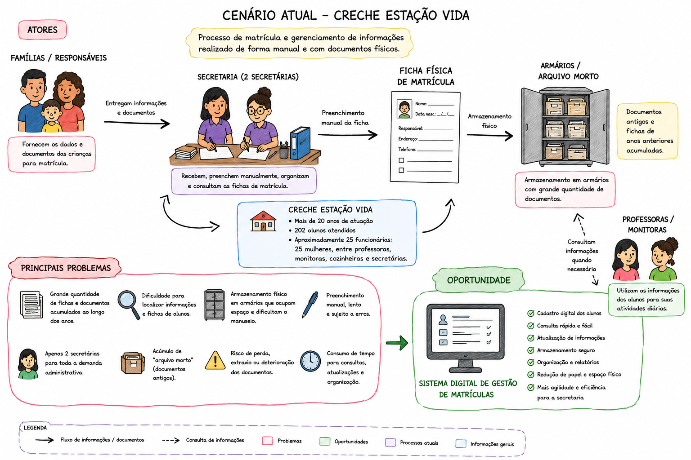
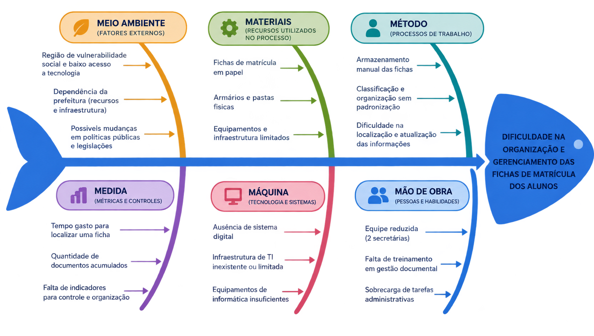
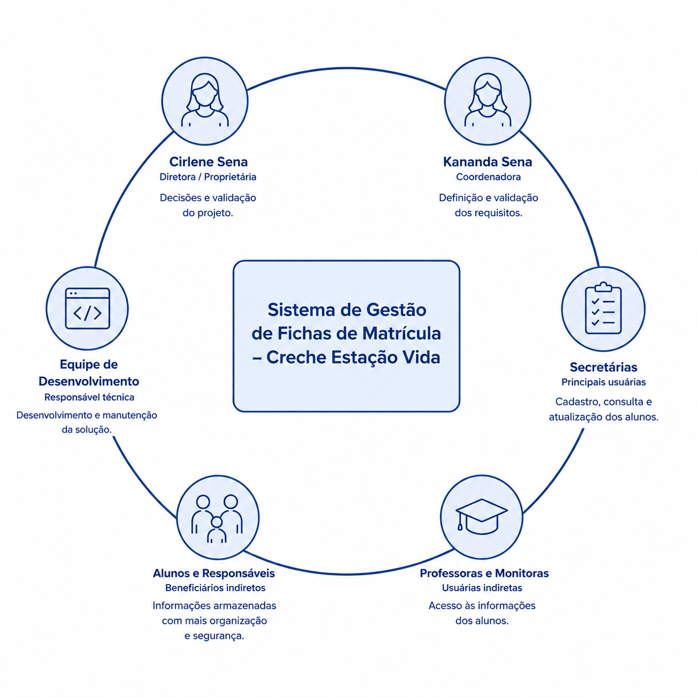

# 1. Cenário Atual do Cliente e do Negócio

## 1.1 Identificação do Cliente/Parceiro

- **Nome:** Creche Estação Vida
- **Tipo:** Instituição de ensino filantrópica
- **Representante:** Cirlene Sena, diretora da creche
- **Forma de contato:** Reuniões por videochamadas, WhatsApp e e-mail
- **Vínculo com o projeto:** Cliente real e interessado na resolução do problema tendo como solução o projeto, stakeholder principal do projeto, fornecerá informações essenciais para o desenvolvimento do projeto e avaliará as entregas conforme o projeto for desenvolvido.

## 1.2 Introdução ao Negócio e Contexto

A Creche Estação Vida é uma instituição filantrópica, sem fins lucrativos, localizada em Águas Lindas de Goiás, que atua no atendimento e desenvolvimento de crianças em situação de vulnerabilidade social. A instituição funciona das 7h30 às 19h30, oferecendo um ambiente de educação, acolhimento e apoio às famílias atendidas.

Atualmente, a creche atende 202 alunos, em sua maioria provenientes de famílias da região onde está localizada. Por estar inserida em uma área de baixa renda, a instituição possui um papel importante no atendimento às crianças e no suporte às suas famílias, contribuindo para o desenvolvimento infantil em um ambiente saudável e estável.

A Creche Estação Vida é vinculada à prefeitura da cidade e conta com profissionais responsáveis pelas atividades educacionais, de cuidado e administrativas. Ao longo dos anos de funcionamento, a instituição acumulou uma grande quantidade de informações e documentos relacionados aos alunos.

Apesar de sua atuação junto à comunidade, a creche enfrenta dificuldades relacionadas ao cadastro, armazenamento e manutenção das fichas de matrícula. Atualmente, o preenchimento e o gerenciamento dessas informações são realizados de forma manual, utilizando papel e caneta, o que dificulta a organização, a consulta e a manutenção dos dados dos alunos.

## 1.3 Rich Picture

A Creche Estação Vida possui mais de 20 anos de atuação e atende atualmente 202 alunos. Devido ao longo período de funcionamento, a instituição acumulou uma grande quantidade de fichas e documentos de matrícula, tornando o cadastro, armazenamento e consulta dessas informações mais trabalhosos.

Atualmente, as matrículas são realizadas manualmente, utilizando fichas de papel que são armazenadas em armários, incluindo documentos antigos do chamado "arquivo morto". Esse processo dificulta a localização e manutenção das informações.

A instituição conta com aproximadamente 25 funcionárias, sendo apenas 2 secretárias responsáveis pelas atividades administrativas. Dessa forma, a grande quantidade de documentos e a equipe reduzida contribuem para a sobrecarga e dificultam o gerenciamento das informações.

> **Figura 1** — Diagrama do cenário atual da Creche Estação Vida, ilustrando o processo de cadastro, armazenamento e consulta das informações dos alunos de forma manual, utilizando fichas físicas e arquivos em armários, evidenciando os principais atores envolvidos, o fluxo de informações, os problemas enfrentados e a oportunidade de digitalização desse processo.

## 1.4 Identificação da Oportunidade ou Problema

Foi elaborado um diagrama de Ishikawa a partir do levantamento realizado junto à Creche Estação Vida, contemplando as principais causas relacionadas às dificuldades enfrentadas pela instituição no armazenamento, organização e manutenção das fichas de matrícula dos alunos.

Atualmente, grande parte das informações é registrada manualmente, utilizando fichas de papel que posteriormente são armazenadas em armários. Esse processo dificulta a localização, consulta e atualização das informações, além de exigir espaço físico para o armazenamento dos documentos.

O grande volume de fichas acumuladas ao longo dos anos, juntamente com a quantidade reduzida de profissionais responsáveis pelas atividades administrativas, torna o gerenciamento dessas informações ainda mais trabalhoso e suscetível à perda ou deterioração dos documentos.

Dessa forma, existe uma oportunidade de melhorar os processos internos por meio da digitalização das fichas de matrícula, proporcionando maior facilidade de acesso, organização e segurança das informações.

Portanto, o desenvolvimento de um sistema digital para cadastro e gerenciamento das fichas de matrícula representa uma oportunidade de modernizar o processo administrativo da creche, reduzir a dependência de documentos físicos e tornar a manutenção das informações dos alunos mais eficiente.

### Causas identificadas no diagrama de Ishikawa

- **Meio ambiente (fatores externos):** região de vulnerabilidade social e baixo acesso a tecnologia; dependência da prefeitura (recursos e infraestrutura); possíveis mudanças em políticas públicas e legislações.
- **Materiais (recursos utilizados no processo):** fichas de matrícula em papel; armários e pastas físicas; equipamentos e infraestrutura limitados.
- **Método (processos de trabalho):** armazenamento manual das fichas; classificação e organização sem padronização; dificuldade na localização e atualização das informações.
- **Medida (métricas e controles):** tempo gasto para localizar uma ficha; quantidade de documentos acumulados; falta de indicadores para controle e organização.
- **Máquina (tecnologia e sistemas):** ausência de sistema digital; infraestrutura de TI inexistente ou limitada; equipamentos de informática insuficientes.
- **Mão de obra (pessoas e habilidades):** equipe reduzida (2 secretárias); falta de treinamento em gestão documental; sobrecarga de tarefas administrativas.

**Problema central:** dificuldade na organização e gerenciamento das fichas de matrícula dos alunos.

## 1.5 Desafios do Projeto

O principal desafio do projeto é realizar a **digitalização das fichas de matrícula atualmente armazenadas em documentos físicos**. A Creche Estação Vida possui um grande volume de fichas acumuladas ao longo dos anos, o que dificulta a organização, localização e manutenção das informações. Além disso, a quantidade de documentos tende a aumentar com o passar do tempo, tornando necessário desenvolver uma solução que permita o armazenamento organizado e facilite o acesso aos dados.

Outro desafio está relacionado à **equipe reduzida da secretaria**, composta por apenas duas responsáveis pelas atividades administrativas. Como o cadastro, a consulta e a atualização das fichas são realizados manualmente, essas atividades demandam tempo e podem sobrecarregar a equipe. Dessa forma, o sistema deverá ser simples e intuitivo, permitindo que as responsáveis realizem suas atividades sem a necessidade de conhecimentos técnicos avançados.

Também será necessário considerar a **transição dos documentos físicos para o sistema digital.** Será preciso definir quais informações das fichas atuais deverão ser cadastradas e como os documentos antigos serão tratados, garantindo que informações importantes não sejam perdidas durante o processo.

Assim, o projeto deverá transformar um processo que é, atualmente, manual e baseado em documentos físicos em um processo **digital, organizado e de fácil utilização**, considerando o volume de informações, a equipe disponível e a necessidade de preservar os dados existentes. A solução deverá priorizar as funcionalidades essenciais para atender às necessidades da creche sem tornar o sistema complexo para suas usuárias.

## 1.6 Mapa de Stakeholders

Os principais stakeholders do projeto são:

- **Cirlene Sena** — diretora da instituição e proprietária do imóvel, principal responsável pela tomada de decisões, validação das prioridades e avaliação das entregas.
- **Kananda Sena** — coordenadora da instituição, responsável por contribuir na definição e validação dos requisitos da solução.
- **Secretárias** — principais usuárias do sistema, realizando o cadastro, consulta e atualização das informações dos alunos.
- **Professoras e monitoras** — impactadas pela maior facilidade de acesso às informações necessárias para suas atividades.
- **Alunos e seus responsáveis** — beneficiados indiretamente pela maior organização e segurança dos dados.
- **Equipe de desenvolvimento** — responsável por implementar a solução e garantir sua funcionalidade, usabilidade e segurança.

### Tabela de stakeholders

| Stakeholder | Rel. com a solução | Interesse Principal | Influência |
|---|---|---|---|
| Cirlene Sena (Diretora/Proprietária) | Tomadora de decisão e responsável pela instituição | Garantir uma gestão organizada e eficiente das informações dos alunos | Alta |
| Kananda Sena (Coordenadora) | Participa da definição de requisitos e validação da solução | Facilitar o acesso às informações e apoiar a gestão da instituição | Alta |
| Secretárias | Principais usuárias do sistema, responsáveis pelo cadastro, consulta e atualização das fichas | Ter um sistema simples e intuitivo que reduza o trabalho manual e otimize o tempo | Alta |
| Professoras e Monitoras | Usuárias indiretas da solução, fornecem e utilizam informações cadastradas | Acesso fácil e rápido às informações dos alunos para apoiar o processo educacional | Média |
| Alunos e responsáveis | Beneficiários indiretos da solução, fornecem e utilizam as informações cadastrais | Maior organização, segurança dos dados e melhor atendimento | Média |
| Equipe de Desenvolvimento | Responsável por desenvolver, implementar e manter o sistema | Entregar uma solução funcional, segura e fácil de utilização | Alta |

## 1.7 Segmentação de Clientes

A Creche Estação Vida possui quatro principais perfis de clientes e públicos impactados pelo sistema:

- **Equipe administrativa (direção, coordenação e secretaria):** principal grupo de usuários da solução, utilizando o sistema para realizar o cadastro, consulta, atualização e organização das informações dos alunos, buscando reduzir o trabalho manual e facilitar o gerenciamento das fichas de matrícula.
- **Equipe pedagógica (professoras e monitoras):** poderá utilizar as informações dos alunos necessárias para o desenvolvimento das atividades e acompanhamento das crianças, tendo maior facilidade para consultar dados que atualmente estão armazenados em documentos físicos.
- **Responsáveis (pais e familiares):** são responsáveis por fornecer as informações utilizadas no processo de matrícula e poderão ser beneficiados indiretamente pela maior organização e segurança dos dados, reduzindo as dificuldades relacionadas à localização e manutenção das informações cadastrais. Alguns responsáveis também solicitam informações de ex-alunos da creche, com mais de 20 anos de históricos, tornando a recuperação dessas informações muito complicada.
- **Alunos (crianças) e comunidade:** principais beneficiários indiretos da solução, pois uma gestão mais organizada das informações pode contribuir para um atendimento mais eficiente e reduzir os riscos relacionados à perda ou dificuldade de acesso aos dados dos alunos.