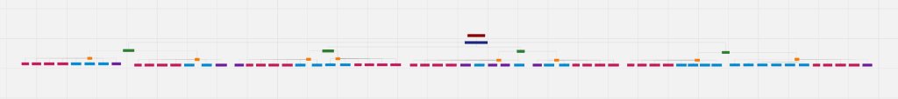

# 8. Requisitos

## 8.1 Lista de Requisitos Funcionais (Especificação Suplementar)

Os requisitos funcionais estabelecem um consenso que fomenta a implementação dos objetivos planejados para o sistema SIGMA. A seguir, é apresentado o escopo atualizado do sistema, organizado de acordo com os Objetivos Específicos (OEs) e as Características do Produto (CPs).

---

### (OE.1) Facilitar e agilizar a organização e a continuidade do processo administrativo

**CP2 - Edição e Atualização de cards de matrícula**

| ID | Nome do requisito | Descrição |
| :--- | :--- | :--- |
| RF10 | Editar fichas do card | As secretárias devem poder editar qualquer uma das informações das fichas de um aluno, a fim de que possam manter os dados atualizados. |
| RF11 | Inativar card de aluno | As secretárias devem poder inativar um card de um aluno, mudando o status da matrícula dele para "inativo", restringindo esse card e impossibilitando qualquer ação com ele. |
| RF12 | Reativar card de aluno | Permitir a alteração, pelas secretárias, do status do card de aluno para ativo, habilitando ações do sistema com aquele card. |

**CP3 - Consulta de informações dos cards de matrícula**

| ID | Nome do requisito | Descrição |
| :--- | :--- | :--- |
| RF16 | Baixar fichas e documentos | O sistema deve permitir que o administrador ou o perfil autorizado baixe individualmente uma ficha de matrícula ou um documento anexado a ela, em formato PDF. |
| RF21 | Buscar aluno pelo nome | O sistema deve permitir que as secretárias ou o perfil autorizado busquem alunos informando o nome completo ou parte dele, sem diferenciar maiúsculas, minúsculas e acentos. O resultado deve retornar os dados de registro de matrícula do aluno. |

---

### (OE.2) Preservar e centralizar o histórico e as informações das matrículas

**CP1 - Gerenciamento de cards de matrícula**

| ID | Nome do requisito | Descrição |
| :--- | :--- | :--- |
| RF08 | Cadastrar card de aluno | As secretárias devem poder criar card de alunos que representam os registros de matrícula de tal. |
| RF09 | Preenchimento de fichas | As secretárias devem poder preencher as fichas e termos: socioeconômico, requerimento de matrícula, termo de autorização de imagem, termo de saída de aluno e de compromisso escolar, preenchendo assim os dados de tais. |

**CP5 - Gerenciamento de documentos**

| ID | Nome do requisito | Descrição |
| :--- | :--- | :--- |
| RF14 | Anexar documentos | O sistema deve permitir que o administrador ou o perfil autorizado anexe documentos digitalizados às fichas dos alunos. |
| RF15 | Editar documento | O sistema deve permitir que o administrador ou o perfil autorizado substitua um documento já anexado a uma ficha, por meio da anexação de um novo arquivo PDF. A substituição deve remover o arquivo anterior e manter apenas o novo. |

---

### (OE.3) Controlar o acesso e garantir a segurança das informações do sistema

**CP4 - Controle de acesso de usuários**

| ID | Nome do requisito | Descrição |
| :--- | :--- | :--- |
| RF05 | Cadastrar Usuários | Permitir aos usuários referentes à equipe administrativa cadastrar novas contas de administração ao sistema. |
| RF06 | Realizar login | As secretárias da instituição deverão ser capazes de realizar login padrão com nome de usuário e senha. |
| RF07 | Realizar logout | As secretárias da instituição deverão ser capazes de realizar logout de sua conta. |

**CP8 - Auditoria e Integridade**

| ID | Nome do requisito | Descrição |
| :--- | :--- | :--- |
| RF17 | Apresentar histórico de edições | O sistema deve permitir que o administrador ou o perfil autorizado consulte o histórico de edições de uma ficha, exibindo no mínimo: (i) nome do usuário que realizou a edição, (ii) data e hora da edição, (iii) campo alterado, (iv) valor anterior e (v) valor novo. |
| RF23 | Possibilitar salvamento de dados | O sistema deve pedir às secretárias ou ao perfil autorizado a confirmação da operação ao solicitar o salvamento do preenchimento ou da edição de uma ficha de matrícula, oferecendo as opções "Confirmar" e "Cancelar". |

---

### (OE.4) Facilitar a comunicação interna entre a equipe administrativa

**CP6 - Avisos Rápidos**

| ID | Nome do requisito | Descrição |
| :--- | :--- | :--- |
| RF01 | Disponibilizar quadro de avisos | O sistema deve disponibilizar um quadro de avisos de modificações, inserções e exclusões de informação referentes às matrículas para os usuários referentes à equipe administrativa. |
| RF02 | Lançar avisos | Permitir que os usuários autenticados referentes à equipe administrativa possam lançar avisos contendo os campos obrigatórios de assunto e descrição, com data e autor registrados, e direcionar os mesmos aos demais usuários. |
| RF03 | Exibir avisos | Exibir avisos aos usuários referentes à equipe administrativa no momento em que forem lançados, mantendo a notificação ativa no sistema até um usuário inativo ficar ativo e poder ler a notificação. |
| RF04 | Apagar avisos | Permitir aos usuários referentes à equipe administrativa apagar de forma definitiva avisos do quadro de avisos para si mesmos, sem confirmação de exclusão. |

**CP7 - Módulo de gerenciamento de turmas e etapas**

| ID | Nome do requisito | Descrição |
| :--- | :--- | :--- |
| RF13 | Vincular aluno a turma | O sistema deve permitir que o administrador ou perfil autorizado vincule um aluno (card) a uma turma existente. |
| RF18 | Cadastrar Etapa | O sistema deve permitir que o administrador ou o perfil autorizado cadastre uma nova etapa (série de ensino) no sistema. |
| RF19 | Inativar turma e etapa | O sistema deve permitir que as secretárias ou o perfil autorizado alterem o status de uma turma ou etapa de "ativo" para "inativo". Uma turma ou etapa inativa mantém os vínculos já existentes e continua aparecendo na busca, identificada com o status "inativo". |
| RF20 | Vincular turma à etapa | O sistema deve permitir que as secretárias ou o perfil autorizado vinculem uma turma a uma etapa, selecionando ambas entre as cadastradas com status ativo. |
| RF22 | Buscar turmas e etapas | O sistema deve permitir que as secretárias ou o perfil autorizado busquem turmas e etapas pelo nome completo ou parcial. Caso nenhum registro seja encontrado, o sistema deve exibir a mensagem "Nenhum resultado encontrado". |
| RF24 | Cadastrar Turma | O sistema deve permitir que o administrador ou o perfil autorizado cadastre uma nova turma, obrigatoriamente vinculada a uma etapa existente. |

---

## 8.2 Lista de Requisitos Não Funcionais (Especificação Suplementar)

Os requisitos não funcionais definem critérios de qualidade do sistema SIGMA. A tabela a seguir apresenta os RNFs com sua classificação segundo as categorias do modelo FURPS+/URPS (Usabilidade, Confiabilidade, Desempenho, Segurança).

| ID | Nome do requisito | Descrição | Classificação URPS+ |
| :--- | :--- | :--- | :--- |
| RNF01 | Privacidade de Dados e Retenção Segura | Garantir a privacidade dos dados pessoais restringindo sua visualização apenas a usuários autenticados, apoiando a segurança da informação exigida pela LGPD. | Segurança |
| RNF02 | Restrição de Acesso não Autenticado | O sistema deve restringir o acesso às suas funcionalidades internas exclusivamente a usuários autenticados por meio de credenciais válidas cadastradas (e-mail e senha). Qualquer tentativa de acesso não autenticado deve ser bloqueada, resultando no redirecionamento do usuário para a tela de login (na interface de usuário) e retornando o código de status HTTP 401 - Unauthorized (na comunicação com a API). | Segurança |
| RNF03 | Interface responsiva e adaptável a múltiplos dispositivos | O sistema deve adaptar seus componentes visuais para resoluções de monitores desktop e dispositivos móveis, garantindo o funcionamento e layout adequado em resoluções de tela de 360px (mobile), 768px (tablet) e 1280px (desktop). A validação deve ser feita através de ferramentas de inspeção de navegador. | Usabilidade |
| RNF04 | Interface com suporte a Modo Escuro alternável | O sistema deve disponibilizar a opção de "modo escuro" alternável para o usuário, aplicando uma paleta de cores escura e textos de alto contraste, preservando a legibilidade e consistência visual. | Usabilidade |
| RNF05 | Tempo de Resposta do Sistema ao Logar | Garantir tempo menor que 2 segundos para login, medido a partir do clique no botão de entrar até a autorização de acesso, sob condições normais de rede e servidor. | Desempenho |
| RNF06 | Tempo de Resposta do Sistema ao Buscar aluno | Retornar os resultados da consulta de alunos em um tempo inferior a 2 segundos para 95% das requisições, sob condições normais de tráfego de rede e carga do banco de dados. A medição inicia no acionamento do botão de busca e termina ao renderizar a lista na tela. | Desempenho |
| RNF07 | Tempo de resposta do sistema para buscar turmas ou etapas | Retornar os resultados da busca de turmas ou etapas em um tempo inferior a 2 segundos para 95% das requisições, sob condições normais de tráfego de rede e carga do banco de dados. | Desempenho |
| RNF08 | Tempo de resposta para salvar uma ficha | O sistema deve concluir o salvamento de uma ficha em um tempo de resposta inferior a 5 segundos para 95% das requisições, sob condições normais de tráfego de rede e carga do servidor. A medição inicia ao acionar o botão de salvar e termina com a exibição da mensagem de sucesso em tela. | Desempenho |
| RNF09 | Disponibilidade do sistema | O sistema deve garantir uma taxa de acessibilidade de 99,5% durante o horário de funcionamento comercial da creche, compreendido de segunda a sexta-feira, das 07h00 às 19h00. | Confiabilidade |
| RNF10 | Acessos Múltiplos | O sistema deve suportar no mínimo 10 usuários acessando e interagindo simultaneamente com a aplicação, mantendo o tempo de resposta das operações dentro dos limites estabelecidos nos demais requisitos de desempenho. | Desempenho |

---

## 8.3 Árvore de Rastreabilidade

Abaixo está representada a árvore de rastreabilidade dos requisitos do projeto SIGMA, conectando objetivos específicos (OEs), características do produto (CPs) e os requisitos de software. 

A captura abaixo foi registrada no dia **10/10/2026**. Para melhor visualização, navegação e leitura completa com zoom dinâmico, acesse a árvore diretamente no quadro do Miro:

:material-link: **[Acessar Árvore de Rastreabilidade no Miro](https://miro.com/app/board/uXjVEbrie7A=/)**

